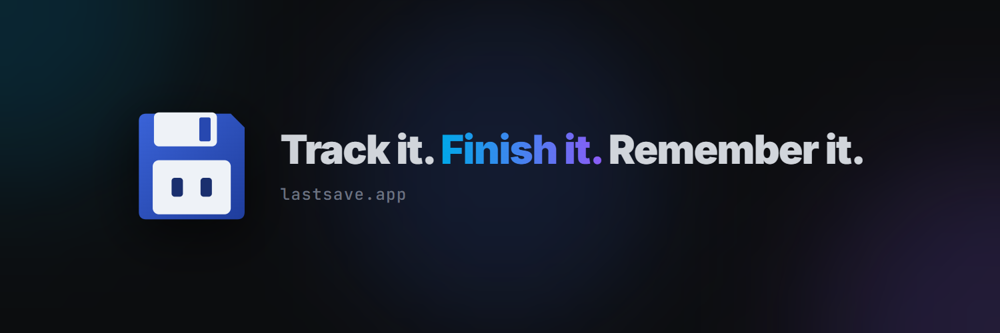

Hi! 👋 We make **LastSave**, a desktop app for your gaming life — built by one developer, in the open
with a small group of players.

### 🗺️ Where things live

| | |
|---|---|
| 💾 **[lastsave](https://github.com/LastSaveApp/lastsave)** | **The app.** Downloads, release notes, bugs and ideas. Start here |
| 🌐 **[lastsave.app](https://lastsave.app)** | The website: what LastSave does, with screenshots |
| 🧰 **[.github](https://github.com/LastSaveApp/.github)** | This page, and the issue forms and security policy every repository shares |

Translations, and later the Gaming Mode themes, will get repositories of their own here so they can
be contributed.

### 🤝 Get involved

- 🎮 **Play it** — [download LastSave](https://lastsave.app/download?ref=github-org) and tell us what you think
- 💬 **Talk to us** — the [Discord](https://discord.gg/cgTuQXwvA4) is where most of it happens
- 🐞 **Report a bug or share an idea** — [open an issue](https://github.com/LastSaveApp/lastsave/issues/new/choose) or start a [discussion](https://github.com/LastSaveApp/lastsave/discussions)
- ⭐ **Star [the repo](https://github.com/LastSaveApp/lastsave)** — it helps other players find it
- ☕ **Support the project** — [Ko-fi](https://ko-fi.com/lastsaveapp) · [GitHub Sponsors](https://github.com/sponsors/LastSaveApp)

### 📣 Follow along

[X](https://x.com/lastsaveapp) ·
[Bluesky](https://bsky.app/profile/lastsaveapp.bsky.social) ·
[Instagram](https://www.instagram.com/lastsave.app) ·
[YouTube](https://www.youtube.com/@LastSave-App) ·
[TikTok](https://www.tiktok.com/@lastsaveapp) ·
[Twitch](https://www.twitch.tv/lastsaveapp) ·
[Mastodon](https://mastodon.social/@lastsaveapp) ·
[Reddit](https://www.reddit.com/r/lastsaveapp) ·
[itch.io](https://lastsaveapp.itch.io)

Say hi at hello@lastsave.app. Thank you for being here. 💙
